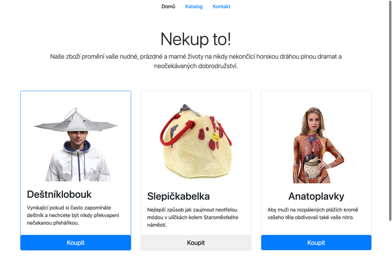

# Lekce 06
# Cvičení: Pokročilé třídy a innerHTML

<strong>Úkol č. 1: Nekup to, třídy</strong>

Vytvořte si repozitář ze šablony cviceni-nekupto. Repozitář obsahuje stránku, která nabízí několik neotřelých produktů.

Otevřete si naklonovanou složku ve VS Code a prohlédněte si zdrojové HTML. Stránka je nastylována pomocí CSS knihovny Bootstrapu. Co přesně dělají použité CSS třídy není pro toto cvičení podstatné, nemusíte jim věnovat velkou pozornost.
V konzoli prohlížeče si do proměnné uložte kartu s prvním produktem. Pomocí metody classList.add přidejte na tento element třídu border-primary, abychom první produkt na stránce zvýraznili.
Do jiné proměnné v konzoli si uložte tlačítko na druhé kartě. Pomocí metody classList.remove odeberte třídu btn-primary a podívejte se, jak se tlačítko vizuálně změnilo.
Do další proměnné si uložte element s třídou card-title posledního produktu. Pomocí voláni metody classList.toggle přidejte na tento element třídu text-center. Text by se měl tímto zarovnat na střed. Vyzkoušejte si, že když tuto metodu zavoláte znova, třída se z prvku odstraní. Takto můžete přepínat mezi přidáním a odebráním třídy pomocí opakovaného volání této metody.
Na konci by stránka v prohlížeči měla vypadat jako na obrázku níže:

<strong>Úkol č. 2: Nekup to, obsah</strong>

Pokračujte v předchozím cvičení. Všimněte si, že v souboru index.js jsou uloženy údaje k jednotlivým produktům. Budeme chtít obsah naší stránky vygenerovat z těchto dat místo abychom je měli natvrdo zadrátované v HTML kódu.

Otevřete si soubor index.html a zkopírujte si HTML obsah prvního produktu a vytvořte z něj řetězec v přiloženém JavaScriptovém souboru. 

Obsah prvního produktu v souboru index.html můžeme nyní smazat.

Pomocí interpolace řetězců předělejte váš JavaScriptový kód tak, že do vašeho řetězce s produktem vložíte obsah vlastností image, name a description.

Do nějaké proměnné si uložte element prvního produktu a nastavte jeho innerHTML na váš sestavený řetězec. Tímto na stránku vložíme obrázek prvního produktu.

Opakujte tento postup pro všechny ostatní produkty. Na konci byste měli dospět do stavu, kdy soubor index.html vůbec neosahuje vnitřek karet pro jednotlivé produkty. Jejich obsah je celý vyroben JavaScriptem z připravených dat.

<strong>Used methods:</strong>
Array.map(), Array.join()
event.target, event.currentTarget, event.currentTarget.lastChild
querySelectorAll(), Array.forEach()